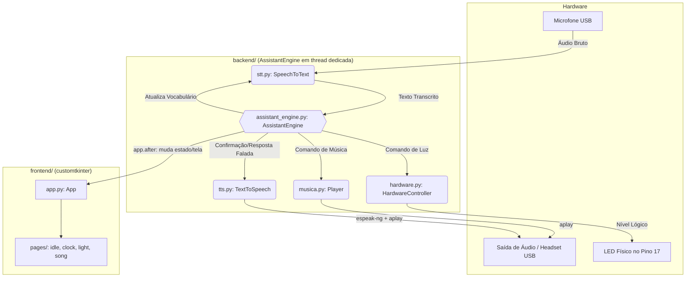
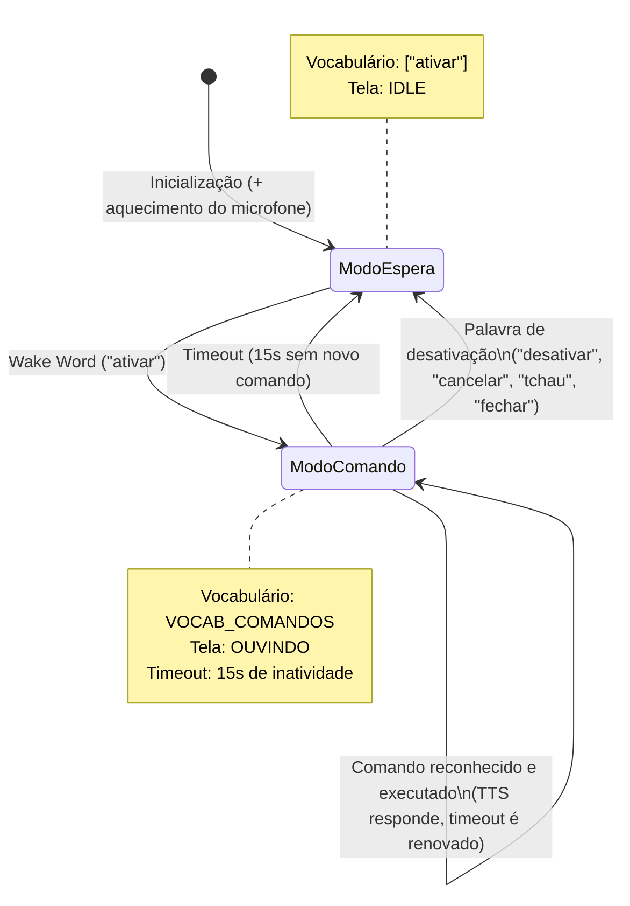
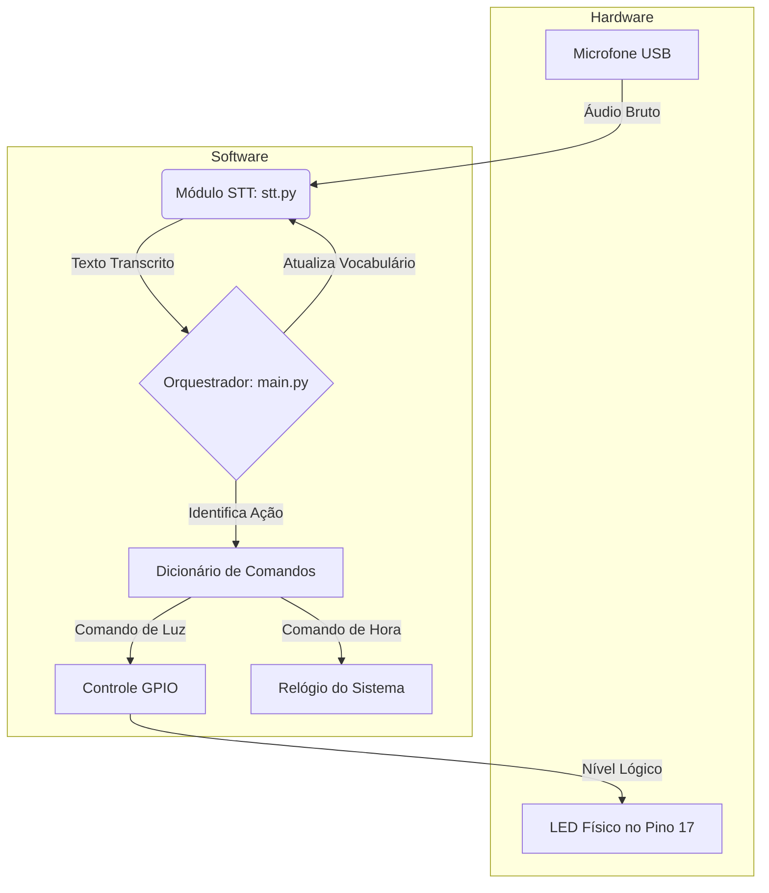
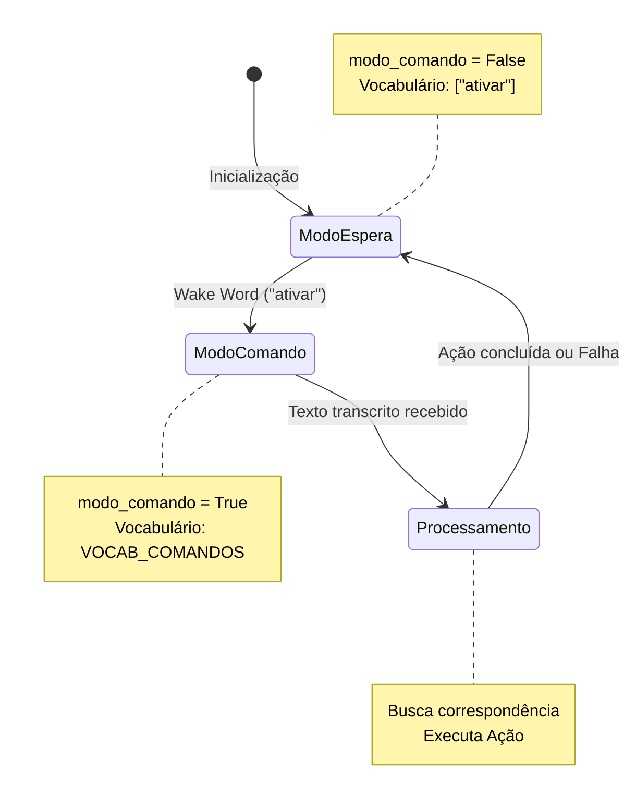
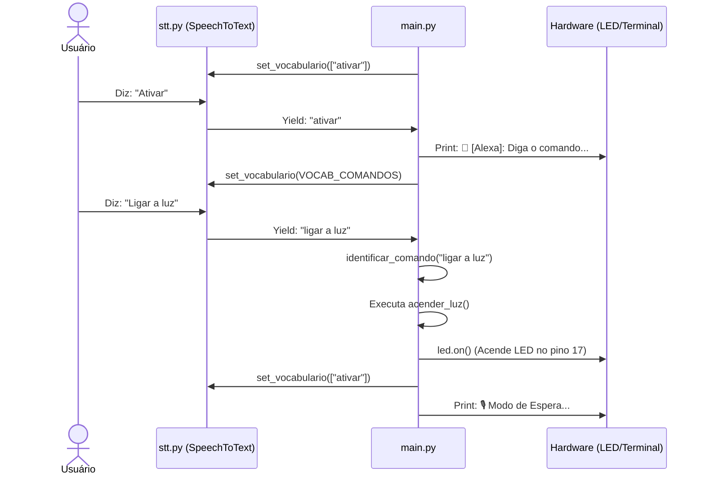
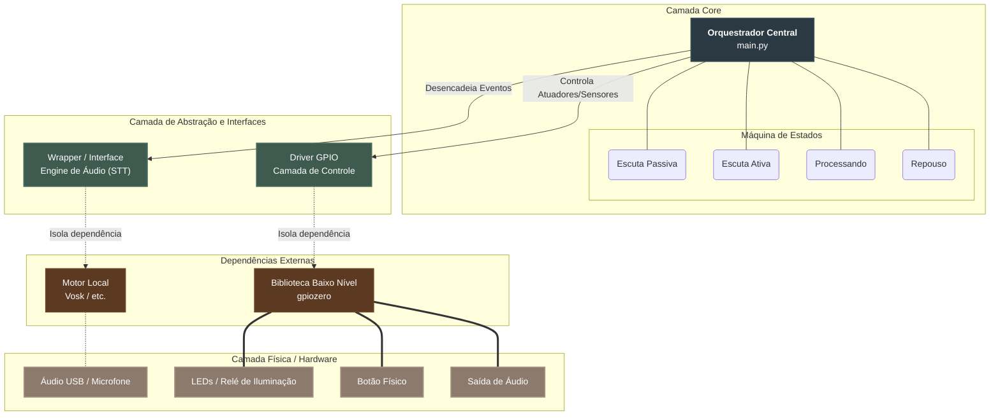
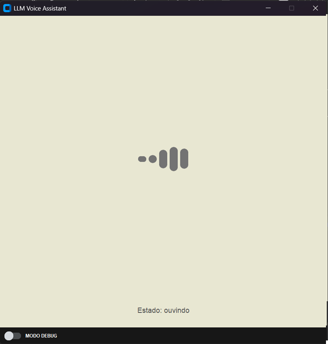
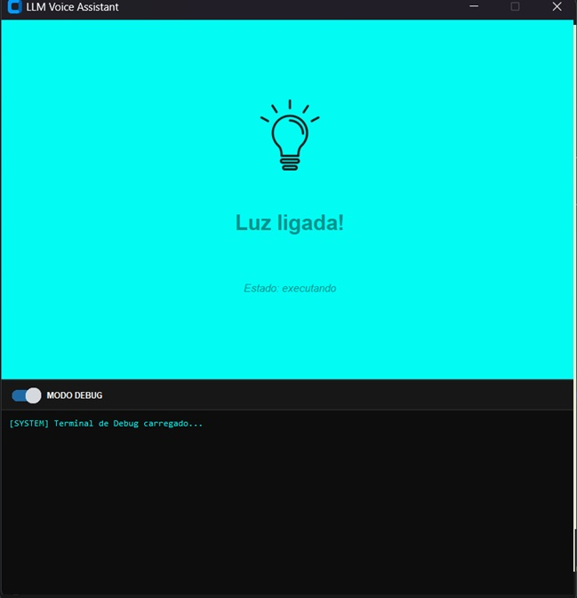
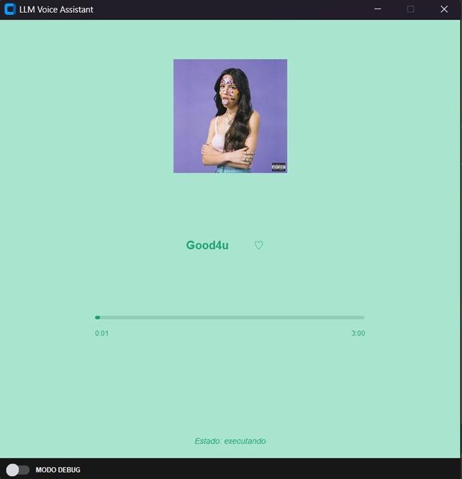
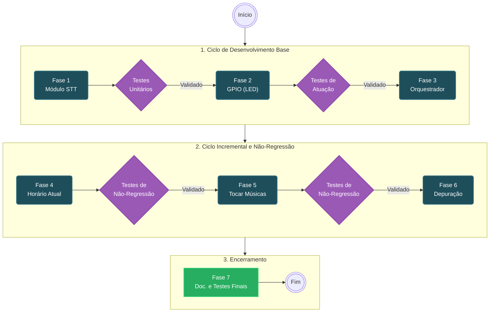

# LLM Voice Assistant - Assistente de Voz Offline Baseado em Raspberry Pi

## 1. Introdução

### 1.1 Motivação e Justificativa
Com a popularização de assistentes virtuais comerciais (como a Alexa da Amazon, o Google Assistant e a Siri da Apple), a automação residencial e o controle de dispositivos por voz tornaram-se interfaces comuns de interação humano-computador. Contudo, esses sistemas comerciais possuem uma grande dependência de conectividade com a nuvem, o que impõe desafios significativos referentes à **privacidade dos dados**, **latência de rede** e **indisponibilidade na ausência de conexão à internet**.

A arquitetura proposta neste projeto aborda essas restrições por meio do desenvolvimento de um **Assistente de Voz 100% Offline**, embarcado em uma placa **Raspberry Pi 3**. Toda a inferência de áudio, processamento de palavras de ativação e reconhecimento de fala (*Speech-to-Text - STT*) ocorre diretamente no hardware local, garantindo a privacidade do usuário, eliminando o tráfego de dados para servidores externos e oferecendo uma resposta previsível e determinística.

Um projeto similar usado como  referência da comunidade open-source, foi o **Vosk API**: [https://github.com/alphacep/vosk-api](https://github.com/alphacep/vosk-api).

---

## 2. Objetivos

### 2.1 Objetivo Geral
Desenvolver, integrar e avaliar um Assistente de Voz 100% Offline e embarcado em uma plataforma Raspberry Pi 3, capaz de processar comandos de fala localmente para o controle acionável de iluminação periférica via GPIO e reprodução de faixas de áudio nativas, garantindo privacidade, baixa latência e operação independente de conectividade com a internet.

### 2.2 Objetivos Específicos
* **Reconhecimento de Fala (STT) e Mapeamento de Comandos:**
  * Integrar um motor de *Speech-to-Text* (STT) de vocabulário restrito otimizado para a arquitetura ARM do Raspberry Pi 3.
  * Implementar um algoritmo determinístico de correspondência de texto (*string matching*) para mapear comandos específicos (ex: `"Ligar LED"`, `"Tocar Olivia Rodrigo"`, `"Horas"`).

* **Integração de Hardware e Atuadores:**
  * Mapear e controlar os pinos da interface GPIO da placa por meio de um módulo isolado de iluminação ( módulo de controle do LED).
  * Gerenciar a reprodução de mídias sonoras locais através de um player de áudio por meio, também, de um outro módulo isolado.

* **Validação de Desempenho e Qualidade (Requisitos Não Funcionais):**
  * Assegurar a eficiência temporal do sistema, garantindo um intervalo máximo de **2,5 segundos** entre o término da fala do usuário e a ação correspondente (RNF01).
  * Obter uma confiabilidade de reconhecimento com taxa de acerto igual ou superior a **50%** em cenários com nível de ruído ambiental moderado (RNF02).
  * Garantir um tempo de resposta de usabilidade com indicativos visuais/sonoros imediatos em até **500 ms** ao transitar entre estados (RNF03).
  
* **(Opcional) Interface para depuração:**
  * Desenvolver uma interface gráfica que facilite a depuração do sistema desenvolvido, centralizando informações como o seu estado atual em tempo real durante execução, as palavras reconhecidas e se, possível, um botão que permita o início da fala do comando pelo usuário.
  *  A interface visa facilitar o entendimento do sistema e seu funcionamento, tanto pelos desenvolvedores quanto para os avaliadores do projeto, e caracteriza um aumento da carga de processamento exigida da placa para que o sistema completo funcione.
---

## 3. Especificação de Requisitos

A Tabela 1 detalha os Requisitos Funcionais (RF) e Não Funcionais (RNF) definidos para o sistema ao longo da matéria:

### Tabela 1: Especificação de Requisitos do Sistema
| ID | Descrição do Requisito | Tipo |
| :--- | :--- | :---: |
| **RF01** | Reconhecer a palavra de ativação (ex: `"Ativar"`) executando a inferência de áudio 100% localmente no hardware, sem dependência de conexão com a internet. | **RF** |
| **RF02** | O sistema deve mapear uma intenção de voz (ex: `"Luz"`) para acionar um componente de hardware periférico conectado (ex: controle de iluminação). | **RF** |
| **RF03** | Reconhecer a palavra de desativação (ex: `"Desligar"`) executando a inferência de áudio 100% localmente no hardware, e acionar modo "escuta inativa". | **RF** |
| **RF04** | Tocar arquivos de áudio locais (ex: `"Tocar Olivia Rodrigo"`, `"Armandinho"`, `"Crystal Castles"`) acionando o player nativo via saída P2 ou HDMI ao reconhecer o comando específico. | **RF** |
| **RF05** | Indicar as horas no momento atual ao reconhecer o comando específico. (ex: `"Horas"`) | **RF** |
| **RNF01** | **Eficiência:** O intervalo de tempo entre o fim da fala do usuário e o início da ação do sistema não deve ultrapassar **2,5 segundos**. | **RNF** |
| **RNF02** | **Confiabilidade:** Deve apresentar uma taxa de acerto no reconhecimento do comando de pelo menos **50%** em um ambiente com ruído moderado. | **RNF** |
| **RNF03** | **Usabilidade:** Deve fornecer indicativos perceptíveis e imediatos (visuais ou sonoros) em até **500ms** para três estados: `"Ouvindo"`, `"Processando"` e `"Erro de Compreensão"`. | **RNF** |
| **RNF04** | **Reliabilidade:** Ao processo desligar de forma abrupta, deve-se persistir o estado do funcionamento do programa na memória da Raspberry Pi 3. | **RNF** |

---

## 4. Arquitetura do Sistema

### 4.1 Arquitetura Física
A arquitetura de hardware é centralizada na placa Raspberry Pi 3 Model B, atuando como a unidade de processamento responsável por rodar o sistema operacional, executar o modelo de inferência de áudio localmente e orquestrar os periféricos. A parte física é composta pelos seguintes elementos:

* **Entrada/Saída (I/O) de Áudio:** um headset responsável pela captação da voz do usuário (sinal de áudio) e pelo retorno sonoro (como a reprodução de faixas musicais locais).
* **Iluminação:** um circuito simples de LED conectado fisicamente ao pino **GPIO 17** da Raspberry Pi, protegido por um resistor limitador de corrente (220Ω a 330Ω) conectado ao GND (terra).
  > **Nota:** durante o desenvolvimento incremental, o protótipo inicial (`src/`) chegou a usar um buzzer no pino GPIO 12 para os testes de acionamento; a versão consolidada (`backend/`, ver 4.2.2) usa o LED no pino 17 conforme especificado.
* **Alimentação:** fonte de alimentação padrão de 5V adequada para a Raspberry Pi 3, garantindo corrente suficiente para alimentar as portas USB e os pinos GPIO sem queda de tensão durante o processamento da CPU.
* **Processamento:** a CPU ARM da Raspberry Pi, que executa localmente o modelo acústico do Vosk (`vosk-model-small-pt-0.3`) sem necessidade de conexão externa.
  
### 4.2 Arquitetura de Software e Modelagem Comportamental
O software foi desenhado em uma arquitetura modular em camadas, isolando a lógica de negócios da manipulação de hardware. 
* **Camada de Captura e Speech-To-Text (`stt.py`):** encapsula a biblioteca *Vosk* e o *sounddevice*. Utiliza uma fila (`queue.Queue`) e *callbacks* de áudio para processar o fluxo do microfone. Possui otimização dinâmica de vocabulário (`KaldiRecognizer`), reduzindo o custo computacional ao limitar as palavras esperadas de acordo com o estado do assistente.
* **Camada de Orquestração (`main.py`):** Instancia o STT através de um *Context Manager* (`with SpeechToText() as stt`), gerencia a máquina de estados (variável `modo_comando`) e mapeia as frases transcritas para funções diretas de controle de hardware (`gpiozero.LED`) e utilitários de sistema (`datetime`).
* **Camada de Hardware (`LED.py`):** encapsula a biblioteca `gpiozero`, recebendo chamadas do orquestrador para alterar o nível lógico do pino GPIO 17 e acionar o circuito do LED.
  
#### 4.2.1 Máquina de Estados (Diagrama de Transição de Estados)
O comportamento do sistema alterna os vocabulários do motor de reconhecimento para economizar processamento e evitar falsos positivos. O orquestrador central transita entre os seguintes estados:

1. **Estado 1: Modo de Espera / Escuta Passiva**
   * **Ação:** O vocabulário do reconhecedor Kaldi é restrito exclusivamente à *wake word* (`["ativar"]`). Qualquer outro som é ignorado.
   * **Transição:** Ao reconhecer a palavra `"ativar"`, o sistema emite um aviso no terminal, altera a flag `modo_comando` para `True` e transita para o *modo de comando*.

2. **Estado 2: Modo de Comando / Escuta Ativa**
   * **Ação:** O vocabulário do STT é expandido instantaneamente para englobar todas as palavras contidas no dicionário de intenções (`VOCAB_COMANDOS`).
   * **Transição:** O sistema aguarda a próxima fala transcrita e transita para o *Processamento da Intenção*.

3. **Estado 3: Processamento e Ação**
   * **Ação:** A função `identificar_comando(texto)` varre o dicionário de gatilhos. Se houver correspondência, executa a ação atrelada (ex: `acender_luz()`, `mostrar_horas()`, `cancelar()`). Se não houver, informa "Comando não reconhecido".
   * **Transição:** Independentemente do sucesso da ação, a flag `modo_comando` retorna para `False`, o vocabulário é novamente restrito à *wake word* e o sistema retorna ao *Estado 1*.

#### 4.2.2 Arquitetura Consolidada (`backend/` e `frontend/`)
A partir da integração da interface gráfica, o sistema evoluiu para uma arquitetura de duas camadas, orquestradas por um ponto de entrada único, `main.py`, na raiz do projeto:

* **Camada de Backend (`backend/`):** o `AssistantEngine` substitui o orquestrador original, rodando em uma *thread* dedicada e adicionando um mecanismo de **timeout** (15s de inatividade retornam o sistema ao modo de espera automaticamente, sem exigir um comando explícito de desativação). Os módulos `hardware.py`, `musica.py` e `tts.py` isolam, respectivamente, o acionamento do LED, a reprodução de áudio e a síntese de voz (`espeak-ng`) usada para dar retorno falado ao usuário.
* **Camada de Frontend (`frontend/`):** interface gráfica em `customtkinter` (`App`), com telas (`idle`, `clock`, `light`, `song`) que o `AssistantEngine` aciona diretamente (`app.show_view(...)`) conforme o comando reconhecido, substituindo o feedback exclusivamente textual do protótipo inicial.
* **Encerramento controlado:** `main.py` trata `SIGINT`/`SIGTERM` e o fechamento da janela para garantir que os processos externos (`aplay`, `espeak-ng`) sejam finalizados corretamente ao sair.

O protótipo inicial em `src/` (descrito nas seções 4.2 e 4.2.1) permanece no repositório como referência do desenvolvimento incremental, mas não é mais o caminho de execução principal do sistema.

#### 4.2.3 Diagramas da Arquitetura Consolidada (`backend/` + `frontend/`)
Os diagramas abaixo já refletem a arquitetura atual, incluindo o módulo de Text-to-Speech (`tts.py`) — ausente no protótipo inicial — e a separação entre backend e interface gráfica.

##### Diagrama de Blocos (Arquitetura Consolidada)

##### Diagrama de Máquina de Estados (Arquitetura Consolidada)
Diferente do protótipo inicial (que retorna ao Modo de Espera após qualquer comando único), o `AssistantEngine` permite **múltiplos comandos por ativação**, permanecendo em Modo de Comando até um timeout de inatividade ou uma palavra de desativação explícita.

---
### 4.3 Diagramas da Arquitetura do Protótipo Inicial
*(Diagramas abaixo descrevem a arquitetura do protótipo inicial em `src/`, sem TTS nem interface gráfica; ver 4.2.3 para a arquitetura consolidada.)*

O GitHub suporta a renderização nativa dos diagramas abaixo (Mermaid).

#### Diagrama de Blocos (Arquitetura do Código)
Estrutura lógica refletindo a injeção de dependências e a distribuição de responsabilidades nos scripts Python.

### Diagrama de Máquina de Estados 
Representação visual baseada na variável lógica `modo_comando` e nas atualizações de vocabulário do `Vosk`.

### Diagrama de sequência
Fluxo temporal detalhado demonstrando a alteração de contexto entre o usuário, o orquestrador e o hardware.

---

## 5. Ferramentas, Linguagens e Componentes

### 5.1 Linguagens de Programação
* **Python 3.x**: Linguagem adotada para o desenvolvimento de toda a lógica do assistente. Foi escolhida devido ao suporte maduro a sistemas embarcados, facilidade de integração com drivers de áudio/hardware e ecossistema de bibliotecas para processamento de voz local.

### 5.2 Bibliotecas e Frameworks
* **Speech-to-Text (STT) Engine:**
  * `vosk` (Vosk API): Pacote de reconhecimento de fala offline. Utiliza um modelo em Português do Brasil de vocabulário restrito otimizado para a arquitetura ARM, permitindo a conversão áudio-texto local.
* **Manipulação de Hardware (GPIO):**
  * `gpiozero`: Biblioteca para controle dos pinos de entrada e saída (GPIO) da Raspberry Pi 3, responsável pelo acionamento do hardware de iluminação (LED) 
* **Processamento e Captura de Áudio:**
  * `sounddevice` (interface Python para PortAudio): utilizada para realizar a captura contínua do fluxo de áudio em tempo real enviado pelo microfone, via `RawInputStream` com callback assíncrono.
* **Síntese de Voz (Text-to-Speech):**
  * `espeak-ng`: motor de síntese de voz offline, usado para fornecer retorno falado ao usuário (confirmações de comando, leitura de horas, etc.), com a saída de áudio roteada via `aplay`.
* **Interface Gráfica:**
  * `customtkinter` foi usado para o desenvolvimento das telas de forma, em conjunto com `pillow`, para a manipulação de imagens, e `mutagen`, para a extração de informações de áudio.

### 5.3 Hardware Utilizado
* **Placa de Processamento Central (SBC):** Raspberry Pi 3 Model B.
* **Dispositivo de Captura e Saída de Som:** Headset USB.

---
## 6. Metodologia de Desenvolvimento

A metodologia adotada para a construção do assistente de voz offline fundamentou-se nos princípios já trabalhados anteriormente em laboratório de **desenvolvimento iterativo e incremental**, alinhados a boas práticas de **engenharia de software** (como os princípios SOLID). O foco principal da estrutura de código em `src/` foi garantir a **modularização**, o **desacoplamento de bibliotecas externas** e a **reutilização de componentes**, viabilizando a adição progressiva de novas funcionalidades ao longo das semanas de desenvolvimento sem a necessidade de refatorações destrutivas, de forma que seja possível adicionar o máximo de funcionalidades possível até a entrega final.

Com a memória RAM limitada da Raspberry Pi 3, implementamos um mecanismo de swap para emprestar a memória de SSD como memória RAM. Além disso, colocamos o processo com prioridade máxima para que o modelo tivesse o melhor aproveitamento da CPU durante a execução. 

---

### 6.1 Estrutura Modular e Desacoplamento do Código

A arquitetura de software implementada no diretório `src/` isolou as responsabilidades do sistema em módulos independentes. Essa abordagem viabilizou a abstração dependências de bibliotecas de terceiros, garantindo as seguintes vantagens arquiteturais:

* **Abstração das Engines de Áudio:** Os motores de inferência local (*Vosk*, etc.) não estão acoplados diretamente ao fluxo principal do sistema. Em vez disso, são encapsulados por interfaces/wrappers específicos. Caso seja necessário substituir a biblioteca de *Speech-to-Text* por outra alternativa mais leve ou robusta, a mudança fica restrita ao módulo correspondente, mantendo o restante da aplicação intocado.
* **Isolamento da Camada de Hardware (GPIO Driver):** O controle dos atuadores (iluminação/módulo relé e LEDs de status) e sensores (botão físico) é intermediado por uma camada de controle que abstrai as chamadas diretas de bibliotecas de hardware (como `gpiozero`). Essa segregação foi definida também de modo a facilitar a realização de testes unitários durante o isolamento de falhas, além de esconder a implementação direta em hardware utilizada.
* **Desencadeamento por Eventos e Máquina de Estados:** O orquestrador central do sistema (`main.py` / controlador) gerencia as transições entre estados (*Escuta Passiva*, *Escuta Ativa*, *Processando* e *Repouso*) sem se preocupar com os detalhes de baixo nível da captura do sinal do áudio USB ou do controle de periféricos ligados à placa.

#### Diagrama de Modularização do Código

Ainda visando a fácil extensão de telas também no frontend, foi iniciado o desenvolvimento independente durante a Semana 2 das interface gráfica do sistema. A tela foi codificada de forma a aceitar facilmente a adição de uma nova View/Page dentro da pasta `frontend/pages` com mínima alteração no controlador principal para apenas estender o dicionário de telas usado para aceitar mais uma. Os protótipos das telas desenvolvidas até então estão mostrados abaixo, nas Figuras de 1 a 4, que trazem resultados de simulações estáticas das telas. 

| **Modo Repouso / Escuta Passiva** (`idle.png`) | **Modo Escuta Ativa / Ouvindo** (`ouvindo.png`) |
| :---: | :---: |
|  |  |
| **Comando de Iluminação** (`luz.png`) | **Comando de Reprodução Musical** (`song.png`) |
|  |  |

<small><i>Figuras 1 a 4 - Desenvolvimento independente e ainda não-integrado de telas para a interface de depuração e interação do sistema</i></small>

Esse padrão de desenvolvimento é justamente o que precisamos para facilitar a evolução do sistema até o fim da entrega, com a facilidade de adição de melhorias e manutenção dos módulos individuais. 

---
### 6.2 Fluxo Iterativo de Implementação

O ciclo de desenvolvimento do repositório foi organizado em fases incrementais e orientadas a testes. A estratégia permitiu validar o comportamento do sistema camada por camada, combinando a construção de **módulos isolados** com a execução de **testes unitários automatizados** e **testes de não-regressão** para garantir que a inclusão de novas funcionalidades não quebrasse os recursos já validados.

1. **Módulo STT de Captura e Testes Unitários de Áudio:**
   * Desenvolvimento isolado do módulo de captura do microfone USB.

2. **Módulo de Controle de Periféricos via GPIO (Luz/LED) e Testes de Atuação:**
   * Desenvolvimento do módulo desacoplado de hardware para manipulação de pinos GPIO (para o caso do LED).

3. **Módulo Orquestrador Central do Sistema:**
   * Integração do motor de *Speech-to-Text* (STT) com vocabulário restrito e parser de *string matching* para o entrar em estado de Escuta e ligar o LED.

4. **Retorno de Horário Atual:** 
   * Extensão incremental do orquestrador para suportar a função utilitária de horário atual via comando `"Horas"`.

5. **Tocar músicas pré-definidas:** 
    * Desenvolvimento de módulo de controle de hardware também asbtraído para tocar a música escolhida pelo usuário por meio do comando (`"Tocar {música}"`).

6. **Desenvolvimento de interface de depuração:**
    * Execução de **testes de não-regressão** automatizados para assegurar que a adição da leitura do relógio e faixas musicais não alterou a assertividade dos comandos de iluminação criados anteriormente.

A cada passo avançado, o grupo planeja adicionar testes unitários automatizados ao repositório, de forma a permitir validações rápidas de funcionamento, e também adicionar **testes de não-regressão**, os quais serão atualizados gradativa e iterativamente a partir do Passo 4 para cada nova funcionalidade que conseguirmos desenvolver.

7. **Documentação Final e Realização de Testes Planejados:**
    * Com o sistema completo desenvolvido, realizaremos um último grupo de testes, seguindo a a Tabela de Testes Planejados explicitada abaixo, para documentar os resultados e o desempenho do sistema no relatório 

#### Diagrama de Método de Desenvolvimento

### 6.3 Testes Automatizados

Complementando os testes planejados na Seção 7 (que validam requisitos físicos/temporais diretamente na placa), o repositório conta com uma suíte de testes automatizados (`tests/`), executada via `pytest` a cada `push`/Pull Request pelo GitHub Actions.

* **Cobertura:** reconhecimento e roteamento de comandos (`identificar_comando`), o módulo `SpeechToText`, o tocador de música e a síntese de voz — com o hardware (GPIO, microfone) e os processos externos (`aplay`, `espeak-ng`) simulados (*mocks*), permitindo rodar a suíte em qualquer máquina, sem depender da Raspberry Pi.
* **Valor como teste de não-regressão:** a suíte já identificou duas inconsistências reais durante o desenvolvimento — uma ambiguidade no roteamento de comandos (o gatilho genérico `"luz"` fazia `"apagar a luz"` acionar `acender_luz`) e uma incompatibilidade de formato de áudio na reprodução de música (`.wav` esperado vs. `.mp3` disponível) — validando na prática a estratégia descrita na Seção 6.2.
* **Cobertura de código:** publicada automaticamente no resumo de cada execução no GitHub Actions (≈53% das linhas de `src/`, concentrada na lógica testável sem hardware real).

---
## 7. Testes Planejados

### 7.1 Testes Planejados
* **Teste T01 (RF01 & RNF03)**: Validação do tempo de resposta de (`"Ativar"`) e (`"Desligar"`) com feedback visual em menos de 500ms.
* **Teste T02 (RF02)**: Teste de precisão do acionamento de hardware (LED ligado e desligado).
* **Teste T03 (RF04)**: Teste de execução correta das faixas de áudio pré-definidas.
* **Teste T04 (RF05)**: Teste de display correto do horário atual com o comando (`"Horas"`).
* **Teste T05 (RNF01)**: Cronometragem de latência total entre o encerramento do comando de voz e a execução da ação para diversas amostragens (desejado menor que 2,5s). 
* **Teste T06 (RNF02)**: Teste de Confiabilidade também com diversas emissões de comando (~50) em ambiente com ruído de fundo moderado (desejado pelo menos 50% de acertos).
* **Teste T07 (RNF04)**: Teste de Reliabilidade que ao matar o processo do programa de maneira abrupta, deve-se persistir um log sobre o erro.

### 7.2 Resultados Observados
*(Esta seção será preenchida incrementalmente)*

| ID Teste | Parâmetro Avaliado | Requisitos Associados | Meta | Resultado Medido | Status |
| :--- | :--- | :---: | :---: | :---: | :---: |
| **T01** | Tempo de resposta para palavras de ativação/desativação (`"Ativar"` e `"Desligar"`) e indicação de feedback visual | RF01, RNF03 | < 500 ms | [Vídeo](https://drive.google.com/file/d/1VgksXS5Cvcv5VBpo8SzBBQC8M4KPtRIi/view)  | OK |
| **T02** | Precisão do acionamento de hardware do periférico (LED Ligar/Desligar) | RF02 | 100% de sucesso nas acionaçoes | [Vídeo](https://drive.google.com/file/d/17yvMzZEnAT2EplYF8eHxiztsZADwjX7V/view?usp=sharing) | OK |
| **T03** | Execução e reprodução correta das faixas de áudio pré-definidas | RF04 | 100% de execução correta | [Vídeo](https://drive.google.com/file/d/1VgksXS5Cvcv5VBpo8SzBBQC8M4KPtRIi/view)  | OK |
| **T04** | Exibição/retorno correto do horário atual após comando de voz (`"Horas"`) | RF05 | 100% de precisão | [Vídeo](https://drive.google.com/file/d/17yvMzZEnAT2EplYF8eHxiztsZADwjX7V/view?usp=sharing) | OK |
| **T05** | Latência total entre o fim do comando de voz e a execução da ação (amostragem contínua) | RNF01 | < 2,5 s | Resultado obtido de ~2s de latência, em média, com base em 20 amostragens | OK |
| **T06** | Taxa de acerto/confiabilidade no reconhecimento de comandos em ambiente ruidoso (~50 emissões) | RNF02 | >= 50% de acertos | Atingido 64% de acurácia baseado em 50 testes realizados em laboratório  | OK |
| **T07** | Dados persistidos da última sessão na memória do computador ao matar o processo de maneira abrupta. | OK | Persistência dos dados |  Atingido o salvamento da memória em situações críticas de desligamento | OK |

> **Vídeo de demonstração adicional (T01–T04):** registro em vídeo cobrindo, em sequência, a ativação (`"ativar"`), o acionamento de iluminação (`"acender"`/`"apagar"`), a consulta de horário (`"horas"`) e a reprodução de música (faixa "Olivia Rodrigo"). [Assistir no Google Drive](https://drive.google.com/file/d/1C1NoB8hOFpalSzMZ8HFwpzkO2VEgXw3s/view?usp=sharing) — as faixas adicionadas mais recentemente (Armandinho e Crystal Castles) ainda não foram cobertas por este vídeo nem validadas no T03.

---

## 8. Conclusões e Trabalhos Futuros

### 8.1 Considerações Finais
O projeto atingiu seu objetivo geral: um assistente de voz funcional, executando 100% offline em uma Raspberry Pi 3, capaz de reconhecer uma palavra de ativação, mapear comandos de fala para ações de hardware (iluminação), reprodução de mídia e consulta de horário, com retorno tanto visual (interface gráfica) quanto falado (síntese de voz). A arquitetura evoluiu de um protótipo único em `src/` para uma estrutura modular em camadas (`backend/`/`frontend/`), acompanhada de uma suíte de testes automatizados que ajudou a identificar e documentar defeitos reais ao longo do desenvolvimento.

### 8.2 Direções para Trabalhos Futuros
Se as seguintes oportunidades de aprimoramento e expansão do sistema em trabalhos futuros:

* Corrigir a incompatibilidade de formato de áudio (`.wav` esperado vs. `.mp3` disponível) na reprodução de música.
* **Parcialmente resolvido — reconhecimento de fala (STT):** o dicionário de vocabulário do Vosk foi limpo de palavras curtas/preenchimento (ex.: artigo `"a"` em `"ligar a luz"`, contração `"das"` em `"regue das tramanda"`, e a entrada redundante `"que horas"`), que estavam poluindo o vocabulário restrito e causando transcrições incorretas (ex.: fala não reconhecida sendo transcrita como `"u"`, capturado do gatilho `"good 4 u"`).

* **Ainda em aberto — roteamento de comando:** a ambiguidade específica documentada na Seção 6.3 (gatilho genérico `"luz"` interceptando frases de outros comandos) **persiste**: confirmamos que `"apagar luz"` e `"desligar luz"` continuam sendo roteados incorretamente para `acender_luz`, já que `_identificar_comando` retorna no primeiro gatilho encontrado (iteração por `dict`) e os gatilhos genéricos de `acender_luz` (`"luz"`, `"ligar luz"`) são avaliados antes dos gatilhos mais específicos de `apagar_luz`. A correção exige priorizar gatilhos mais específicos (frases completas) sobre os genéricos antes de casar por substring, não apenas limpar o vocabulário do STT.
* Estender a suíte de testes automatizados para cobrir `backend/` e `frontend/`.
* Executar e registrar os testes físicos pendentes (T05 e T06) na Raspberry Pi.

- **modelos de linguagem mais avançados**: Avaliar a integração de modelos
de fala quantizados mais recentes para aumentar a precisão de transcrição em vocabulários mais amplos sem impactar significativamente a CPU.

- **cancelamento ativo de ruído e pré-processamento de áudio**: Incorporar algoritmos de filtragem na camada de
captura de áudio para elevar ainda mais a taxa de reconhecimento em ambientes extremamente ruidosos (> 65
dB).

- **melhoria da UI**: Consolidar a integração da interface desenvolvida com o orquestrador principal, também adicionando mais funcionalidades, melhorando eficiência e melhorando UX em geral.
---

## Referências Bibliográficas

[1] ALPHACEP. **Vosk Speech Recognition API**. 2023. Disponível em: <https://github.com/alphacep/vosk-api>. Acesso em: 19 ago. 2026.

[2] RASPBERRY PI FOUNDATION. **Raspberry Pi 3 Model B Documentation**. 2022. Disponível em: <https://www.raspberrypi.com/documentation/>. Acesso em: 19 ago. 2026.

[3] GPIOZERO Community. **Gpiozero: A simple interface to GPIO devices with Raspberry Pi**. 2023. Disponível em: <https://gpiozero.readthedocs.io/>. Acesso em: 19 ago. 2026.

[4] PORTAUDIO. **PortAudio Portable Cross-Platform Audio I/O Library**. 2023. Disponível em: <http://www.portaudio.com/>. Acesso em: 19 ago. 2026.

[5] CUSTOMTKINTER. **Modern and customizable Python UI-library based on Tkinter**. Disponível em: <https://github.com/TomSchimansky/CustomTkinter>. Acesso em: 19 ago. 2026.

[6] ESPEAK-NG. **Open source speech synthesizer**. Disponível em: <https://github.com/espeak-ng/espeak-ng>. Acesso em: 19 ago. 2026.
